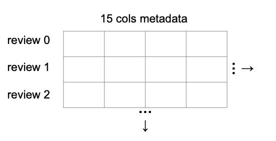
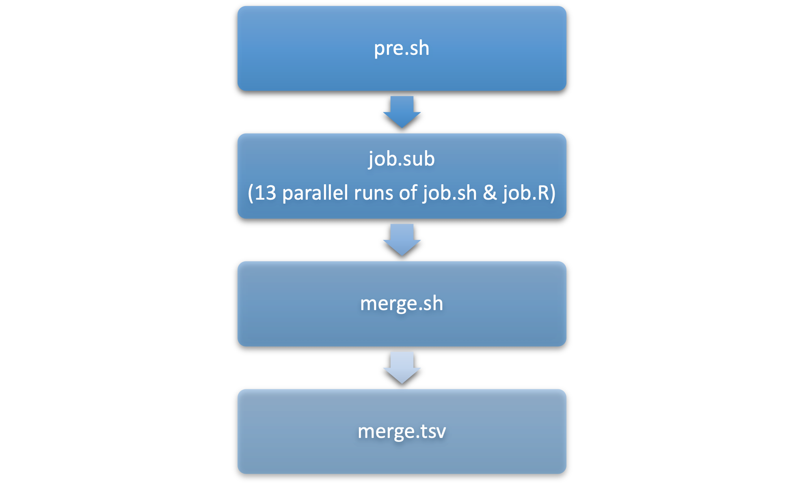

```{r, echo =F, warning=FALSE}
library(ggplot2)
```

## Introduction

We analyzed a subset of the Amazon review dataset, which consisted of 13 different tsv files separated by product category. Each row represents a single review and its associated review metadata, such as *review date*, *review text*, *star rating*, etc. Our goal was to explore users' review behavior and determine which factors are correlated with star ratings based on review metadata. More specifically, we asked two questions: 

* **Given the length of review text and the ratio of helpful votes, is a user is more or less likely to give a high star rating?**
* **Given the length of review text and the ratio of helpful votes, is a user is more or less likely to give an extreme star rating?**

To pursue these questions, we first utilized CHTC to clean and transform 13 tsv files in parallel and merge them into a small tsv file. Then, we further transformed the merged tsv file and performed logistic regression analysis.

Overall, we found that the length of review, the ratio of helpful votes, and their interaction term all significantly affect the probability of a high or an extreme star rating.

## Data Source

We discovered the dataset on Kaggle at https://www.kaggle.com/datasets/cynthiarempel/amazon-us-customer-reviews-dataset. However, we used the original source featuring the same data as our final source, which is  https://s3.amazonaws.com/amazon-reviews-pds/tsv/index.txt.

This dataset covers the Amazon customer reviews from 1995 to 2015 in the United States. There are 45 tsv files in this dataset, but some tsv files were too large to run quickly even in parallel jobs. Therefore, we selected a subset consisting of 13 tsv files from 54 MB to 1.7 GB. 

In our dataset, 13 tsv files are separated by product category, where each row represents a single review. There are 15 columns (variables): `marketplace`, `customer_id`, `review_id`, `product_id`, `product_parent`, `product_title`, `product_category`, `star_rating`, `helpful_votes`, `total_votes`, `vine`, `verified_purchase`, `review_headline`, `review_body`, and `review_date`.


```{r,echo = F, out.width = '40%',fig.align="center"}

```

## Computation

```{r,echo = F, out.width = '40%',fig.align="center"}

```

We first run **13 jobs** in parallel to transform 13 tsv files: a tsv file would be downloaded and decompressed; 5 of 15 columns would be extracted, which are `product_category`, `star_rating`, `helpful_votes`, `total_votes`, and `review_body`; rows with one or more empty values are dropped; rows where `total_votes` is 0 are dropped; create `ratio` (ratio of helpful votes) variable, which was calculated by `helpful_votes` / `total_votes`; create `length` (length of review text) variable, which was the number of character strings separated by a space (" ") as the delimiter; keep only `product_category`, `ratio`,`length`, and `star_rating`. We requested **3 GB** of memory and **3.5 GB** of disk space per job and each job ran between **2 - 10 minutes**. Then, we merge all 13 processed tsv files into one single tsv file "merge.tsv" (85 MB). 

We then made further transformations in result.Rmd, as discussed in the rest of report, to build a logistic regression model to answer our questions.

## Merged Data Summary

The "merge.tsv" has 3415691 rows and 4 columns: `product_category`, `ratio`,`length`, and `star_rating`. We mainly focused on `ratio`,`length` and `star_rating` for further analysis.

```{r, warning = F, echo =F}
df = read.csv("merge.tsv", sep = '\t',header= F)
colnames(df) <- c("product_category","ratio","length","star_rating")
```

##### Ratio (ratio of helpful votes)

Ratio is a continuous variable from 0 to 1 and its mode is 1.

```{r, fig.width=4, fig.height=3, echo = F}
summary(df$ratio)
ggplot(df, aes(x=ratio))+
  geom_histogram(bins = 40,color="darkblue", fill="lightblue")+
  ggtitle("Ratio Histogram")
```

##### Length (length of review text)

Length is a continuous variable from 0 to 1633296. However, large values like 1633296 are unlikely to represent genuine reviews, and were treated as obvious outliers (this may be caused by too much empty space in the review text since we calculated length using space as a delimiter). We decided to use mean $\pm$ 3 times the standard deviation to set an upper bound and lower bound for it. After this change, the distribution of `length` seems more reasonable.

```{r, fig.width=4, fig.height=3, echo = F}
summary(df$length)
ggplot(df, aes(x=length))+
  geom_histogram(bins = 100,color="darkblue", fill="lightblue")+
  ggtitle("Length Histogram Before Changes")
upper = mean(df$length) + 3*sd(df$length) 
lower = mean(df$length) - 3*sd(df$length) 
df = df[(df$length>lower)&(df$length<upper),]
ggplot(df, aes(x=length))+
  geom_histogram(bins = 100,color="darkblue", fill="lightblue")+
  ggtitle("Length Histogram After Changes")
```

##### Star Rating

`star_rating` is a continuous variable, but it should be a categorical variable in the real world. Therefore, we factorized `star_rating`. `star_rating` is one of 1, 2, 3, 4, 5 and its counts are shown below.

```{r, fig.width=4, fig.height=3, echo = F}
df$star_rating = factor(df$star_rating)
summary(df$star_rating)
ggplot(df, aes(x=star_rating))+
  geom_bar(color="darkblue", fill="lightblue",width = 0.4)+
  ggtitle("Star Rating Histogram")
```

## Analysis

If we use a multiple linear regression model, the predicted star rating may be higher than 5 or lower than 1, which is meaningless in this scenario. If we use multinomial logistic regression, we cannot directly answer our questions regarding high star rating and extreme star rating. Thus, we decided to use logistic regression to produce two models. We created two new variables `star1` and `star2` below as dependent variables respectively. For independent variables, we used `length`, `ratio`, and their interaction since we suspected there could be a correlation between these two variables.

#### Model 1

To answer the question that given length of review text and the ratio of helpful votes whether a user is more or less likely to give a high star rating, we set the `star_rating` of 4 or 5 as high, and 1, 2 or 3 as low (low is base level), and put them into a derived variable called `star1`.

In the summary below, we found that `Intercept`, `length`, `ratio`, and interaction `length:ratio` was significant. The estimated model is $ln(\frac{1-p}{p}) = 0.1990 - 0.0006length + 0.8527ratio + 0.0007length * ratio$, where $p$ is the probability of having a high star rating. 

```{r, fig.width=6, fig.height=4, echo = F}
df = transform(df,star1=ifelse((star_rating==4)|(star_rating==5), "high","low"))
df$star1 = factor(df$star1)
df$star1 = relevel(df$star1,"low")
model1 = glm(star1 ~ length * ratio , data = df, family = "binomial")
summary(model1)
predict1 = expand.grid(ratio = seq(from=0, to=1, by=.05), length = seq(min(df$length),max(df$length),by = 3))
predict1$predicted_prob = predict(model1, predict1, type="response")
ggplot(predict1, aes(length, predicted_prob, color=factor(ratio), group=ratio)) +
  geom_line()+
  ggtitle("The Probability of High Star Rating")+
  geom_hline(yintercept=0.5, color = "blue", size = 1.5)
```

For clarification purposes, the y-axis represents the probability of having a high star-rating and the x-axis represents the length of the review. The different colors of each line or curve represent different ratios of helpful votes. 

As the visualization shows, regardless of the helpful votes ratio, those who wrote nothing (length=0) or wrote a very short review were more likely to give high star-ratings, whereas the probability increases as the helpful votes ratio increases. The correlation between the probability of a high star-rating and the length of the review is highly dependent on the helpful votes ratio. When the helpful votes ratio is near 0, the initial decreasing rate of the probability is very large and is diminishing when the length increases. As the helpful votes ratio gradually increases, the initial decreasing rate of the probability decreases and tends to be a straight line (instead of diminishing). When the helpful ratio is near 1, the probability of getting a high star-rating increases as the review length increases. 

#### Model 2

To answer the question that given length of review text and the ratio of helpful votes whether a user is more or less likely to give an extreme star rating, we set the `star_rating` of 1 or 5 as extreme, and 2, 3 or 4 as not extreme (not extreme is base level), and put them into a derived variable called `star2`.

In the summary below, we found that `Intercept`, `length`, `ratio`, and interaction `length:ratio` is significant. The estimated model is $ln(\frac{1-p}{p}) = 0.6568 -0.0004length + 0.1871ratio + 0.0002length * ratio$, where $p$ is the probability of having an extreme star rating. 
```{r, fig.width=6, fig.height=4, echo = F}
df = transform(df,star2=ifelse((star_rating==1)|(star_rating==5), "extreme","not extreme"))
df$star2 = factor(df$star2)
df$star2 = relevel(df$star2,"not extreme")
model2 = glm(star2 ~ length * ratio , data = df, family = "binomial")
summary(model2)
predict2 = expand.grid(ratio = seq(from=0, to=1, by=.05), length = seq(min(df$length),max(df$length),by = 3))
predict2$predicted_prob = predict(model2, predict2, type="response")
ggplot(predict2, aes(length, predicted_prob, color=factor(ratio), group=ratio)) +
  geom_line()+
  ggtitle("The Probability of Extreme Star Rating")+
  geom_hline(yintercept=0.5, color = "green", size = 1.5)
```

To clarify once more, the y-axis represents the probability of having an extreme star-rating and the x-axis represents the length of the review. The different colors of each line or curve represent different ratios of helpful votes. 

As the visualization shows, regardless of the helpful votes ratio, those who wrote nothing (length=0) or wrote a review consisting of less than 1250 words are more likely to give an extreme star-rating, whereas the probability increases as the helpful votes ratio increases. The correlation between the probability of an extreme star-rating and the length of the review is dependent on the helpful votes ratio (but not as highly dependent as model 1). When the helpful votes ratio is near 0, the initial decreasing rate of the probability is very large and is diminishing when the length increases. As the helpful votes ratio gradually increases, the initial decreasing rate of the probability decreases and tends to be a straight line (instead of diminishing). 

## Weakness

Although we successfully used CHTC to clean and transform the dataset in parallel to produce a single file named merge.tsv, and both of our model’s parameters are statistically significant, there are still some weaknesses. Firstly, since we wanted to use the ratio of helpful votes, we divided the number of helpful votes by the number of total votes. In this case we needed to get rid of the rows with 0 total votes, meaning that our model could not estimate those who do not have a vote. Secondly, since we only included the variable ratio, those who have 1 helpful vote over 1 total vote are treated exactly the same as those who have 10 helpful votes over 10 total votes, whereas the nature of the two might be very different. Also, the data summary shows that the number of star-ratings of 5 outnumber the number of star-ratings from 1 to 4. No matter how we build the logistic model, the nature of the model will not be as different as what we expected. Lastly, as we are using a relatively large dataset to build logistic regression models, the z scores are too large, meaning that our p-values are not as useful.

## Conclusion

We questioned whether the ratio of helpful votes and the length of review text could be used to predict whether the star rating is more likely to be low or high, as well as extreme or not extreme. As we have shown by our two graphs in the analysis, the length of review, the ratio of helpful votes, and their interaction term all significantly affect the probability of a high or an extreme star rating. In the future, we may decide to include product category and 0 total votes into our model. We may also draw a random sample to make the quantity of each star rating the same.

## GitHub Address

https://github.com/gjsorrell/stat479-final-project

## Contribution
Chengjing Gong, Greg Sorrell, Sherry Yang contribute to computations and report writing; Chengjing Gong, Greg Sorrell, Sherry Yang, and Sungkyun Lee contribute to presentation slides.