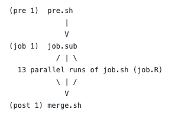

```{r, echo =F, warning=FALSE}
library(ggplot2)
```

## Introduction

We analyzed a subset of Amazon review dataset, consisting of 13 different tsv files, separated by product category, where each row represents a single review and its associated review metadata, such as *review date*, *review text*, *star rating*, etc. Hence, we want to explore users' review behavior and what factors are correlated with star ratings based on review metadata. More specifically, we asked two questions: 

* **Given length of review text and the ratio of helpful votes, if a user is more likely to give a high star rating or not.**
* **Given length of review text and the ratio of helpful votes, if a user is more likely to give an extreme star rating or not.**

To pursue these questions, we first utilized CHTC to clean and transform 13 tsv files in parallel and merge them into a small tsv file. Then, we further transformed the merged tsv file and performed logistic regression analysis in Rmd.

Overall, we found that shorter length of review text or higher ratio of helpful votes are more likely to have high or extreme star rating,

## Data Source

We discovered the dataset on Kaggle at https://www.kaggle.com/datasets/cynthiarempel/amazon-us-customer-reviews-dataset. However, we used the original source featuring the same data as our final source, which is  https://s3.amazonaws.com/amazon-reviews-pds/tsv/index.txt.

This dataset covers the Amazon customer reviews from 1995 to 2015 in the United States. There are 45 tsv files in this dataset, but some tsv files are too large to run fast even in parallel job. Thus, we select a subset, consisting of 13 tsv files from 54 MB to 1.7 GB, as our dataset. 

In our dataset, 13 tsv files are separated by product category, where each row represents a single review. There are 15 columns (variables): `marketplace`, `customer_id`, `review_id`, `product_id`, `product_parent`, `product_title`, `product_category`, `star_rating`, `helpful_votes`, `total_votes`, `vine`, `verified_purchase`, `review_headline`, `review_body`, and `review_date`.


```{r,echo = F, out.width = '40%',fig.align="center"}

```

## CHTC Computation

We first run **13 jobs** in parallel to transform 13 tsv files: a tsv file would be downloaded and decompressed; 5 of 15 columns would be extracted, which are `product_category`, `star_rating`, `helpful_votes`, `total_votes`, and `review_body`; rows with one or more empty values are dropped; rows where `total_votes` is 0 are dropped; create `ratio` (ratio of helpful votes) variable, which was calculated by `helpful_votes` / `total_votes`; create `length` (length of review text) variable, which was the number of character strings separated by a space (" ") as the delimiter; keep only `product_category`, `ratio`,`length`, and `star_rating`. We requested **3 GB** of memory and **3.5 GB** of disk space per job and each job ran between **1 - 6 minutes**. Then, we merge all 13 processed tsv files into one single tsv file "merge.tsv" (85 MB). 

```{r,echo = F, out.width = '40%',fig.align="center"}

```

## Merged Data Summary

"merge.tsv" has 3415691 rows and 4 columns, where columns are `product_category`, `ratio`,`length`, and `star_rating`. We mainly focused on `ratio`,`length` and `star_rating` for further analysis.

```{r, warning = F, echo =F}
df = read.csv("merge.tsv", sep = '\t',header= F)
colnames(df) <- c("product_category","ratio","length","star_rating")
```

##### Ratio (ratio of helpful votes)

Ratio is a continuous variable from 0 to 1 and its mode is 1.

```{r, fig.width=4, fig.height=3, echo = F}
summary(df$ratio)
ggplot(df, aes(x=ratio))+
  geom_histogram(bins = 40,color="darkblue", fill="lightblue")+
  ggtitle("Ratio Histogram")
```

##### Length (length of review text)

Length is a continuous variable from 0 to 1633296. But large values like 1633296 do not make sense in the real world, it may be caused by too much empty space in the review text since we calculated length based on space. Therefore, we decided to use mean $\pm$ 3 times the standard deviation to set an upper bound and lower bound for it. After this changes, the distribution of `length` seems more reasonable.

```{r, fig.width=4, fig.height=3, echo = F}
summary(df$length)
ggplot(df, aes(x=length))+
  geom_histogram(bins = 100,color="darkblue", fill="lightblue")+
  ggtitle("Length Histogram Before Changes")
upper = mean(df$length) + 3*sd(df$length) 
lower = mean(df$length) - 3*sd(df$length) 
df = df[(df$length>lower)&(df$length<upper),]
ggplot(df, aes(x=length))+
  geom_histogram(bins = 100,color="darkblue", fill="lightblue")+
  ggtitle("Length Histogram After Changes")
```

##### Star Rating

`star_rating` is a continuous variable, but it should be a categorical variable in the real world. Therefore, we factorize `star_rating`. `star_rating` is one of 1, 2, 3, 4, 5 and its counts are shown below.

```{r, fig.width=4, fig.height=3, echo = F}
df$star_rating = factor(df$star_rating)
summary(df$star_rating)
ggplot(df, aes(x=star_rating))+
  geom_bar(color="darkblue", fill="lightblue",width = 0.4)+
  ggtitle("Star Rating Histogram")
```

## Analysis

If we use multiple linear regression model, the predicted star rating may be higher than 5 or lower than 1, which is meaningless in this scenario. If we use multinomial logistic regression, we cannot directly answer our questions regarding high star rating and extreme star rating. Thus, we decided to use logistic regression to conduct two models. We would create two new variables `star1` and `star2` below as dependent variables respectively. For independent variables, we use `length`, `ratio`, and their interaction since we suspect there is a correlation between these two variables.

#### Model 1

To answer the question that given length of review text and the ratio of helpful votes if a user is more likely to give a high star rating or not, we set the `star_rating` of 4 or 5 as high, and 1, 2 or 3 as low (low is base level), and put them into a derived variable called `star1`.

From summary below, we found that `Intercept`, `length`, `ratio`, and interaction `length:ratio` is significant. The estimated model is $ln(\frac{1-p}{p}) = 0.1990 - 0.0006length + 0.8527ratio + 0.0007length * ratio$, where $p$ is the probability of having high star rating. From visualization below, combinations of `length` and `ratio` above blue vertical lines are more likely to have high star rating. Generally, either shorter `length` or higher `ratio` are more likely to have high star rating

```{r, fig.width=6, fig.height=4, echo = F}
df = transform(df,star1=ifelse((star_rating==4)|(star_rating==5), "high","low"))
df$star1 = factor(df$star1)
df$star1 = relevel(df$star1,"low")
model1 = glm(star1 ~ length * ratio , data = df, family = "binomial")
summary(model1)
predict1 = expand.grid(ratio = seq(from=0, to=1, by=.05), length = seq(min(df$length),max(df$length),by = 3))
predict1$predicted_prob = predict(model1, predict1, type="response")
ggplot(predict1, aes(length, predicted_prob, color=factor(ratio), group=ratio)) +
  geom_line()+
  ggtitle("The Probability of High Star Rating")+
  geom_hline(yintercept=0.5, color = "blue", size = 1.5)
```


#### Model 2

To answer the question that given length of review text and the ratio of helpful votes if a user is more likely to give an extreme star rating or not,we set the `star_rating` of 1 or 5 as extreme, and 2, 3 or 4 as not extreme (not extreme is base level), and put them into a derived variable called `star2`.

From summary below, we found that `Intercept`, `length`, `ratio`, and interaction `length:ratio` is significant. The estimated model is $ln(\frac{1-p}{p}) = 0.6568 -0.0004length + 0.1871ratio + 0.0002length * ratio$, where $p$ is the probability of having extreme star rating. From visualization below, combinations of `length` and `ratio` above green vertical lines are more likely to have extreme star rating. Generally, either shorter `length` or higher `ratio` are more likely to have extreme star rating.

```{r, fig.width=6, fig.height=4, echo = F}
df = transform(df,star2=ifelse((star_rating==1)|(star_rating==5), "extreme","not extreme"))
df$star2 = factor(df$star2)
df$star2 = relevel(df$star2,"not extreme")
model2 = glm(star2 ~ length * ratio , data = df, family = "binomial")
summary(model2)
predict2 = expand.grid(ratio = seq(from=0, to=1, by=.05), length = seq(min(df$length),max(df$length),by = 3))
predict2$predicted_prob = predict(model2, predict2, type="response")
ggplot(predict2, aes(length, predicted_prob, color=factor(ratio), group=ratio)) +
  geom_line()+
  ggtitle("The Probability of Extreme Star Rating")+
  geom_hline(yintercept=0.5, color = "green", size = 1.5)
```

## Weakness

Although we successfully used CHTC to clean and transform the dataset in parallel to produce a single file named merge.tsv, and both of our model’s parameters are statistically significant, there are still some weaknesses. Firstly, since we want to use the ratio of helpful votes, we divided the number of helpful votes to the number of total votes. In this case, we have to get rid of those rows with 0 total votes so that our model cannot estimate those who do not have a vote. Secondly, since we only include the variable ratio, those who have 1 helpful vote over 1 total vote are treated exactly the same as those who have 10 helpful votes over 10 total votes, whereas the nature of the two might be very different. Lastly, the data summary shows that the number of star-ratings of 5 outnumber the number of star-ratings from 1 to 4. So, no matter how we build the logistic model differently, the nature of the model will not be as different as what we expected.

## Conclusion

We questioned whether the ratio of helpful votes and the length of review text could be used to predict whether the star rating is more likely to be low or high, extreme or not extreme. Our models indicate shorter length of review text or higher ratio of helpful votes are more likely to have high or extreme star rating in general. In the future, we may include product category and 0 total vote into our model. We may also draw a random sample to make number of each star rating the same.

## GitHub Address

https://github.com/gjsorrell/stat479-final-project